# Page walkthrough

This walkthrough is a showcase of some essential functionalities of this integration.

## Home page

We will start our walkthrough from the home page:

### Home page legend:

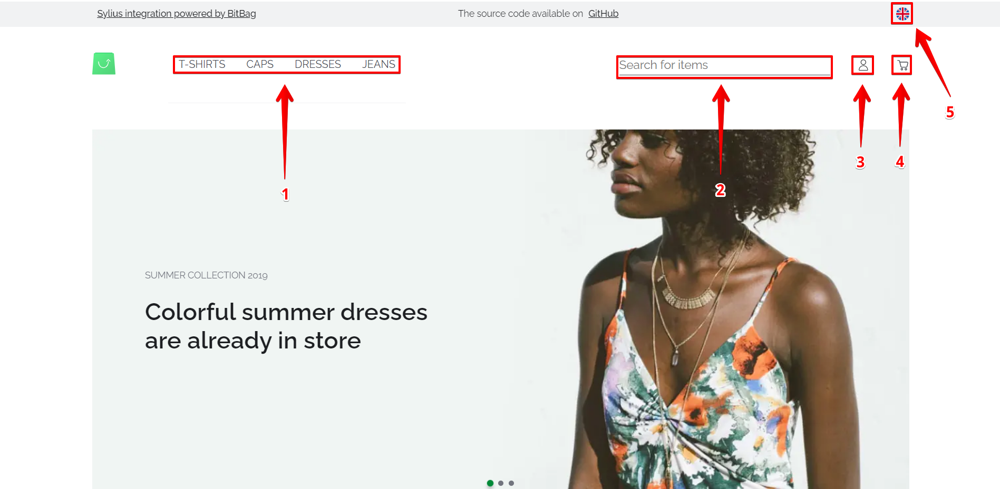

1. Navigation - allows us to go to the selected [Category page](#category-page)

2. Search bar - allows us to search for products

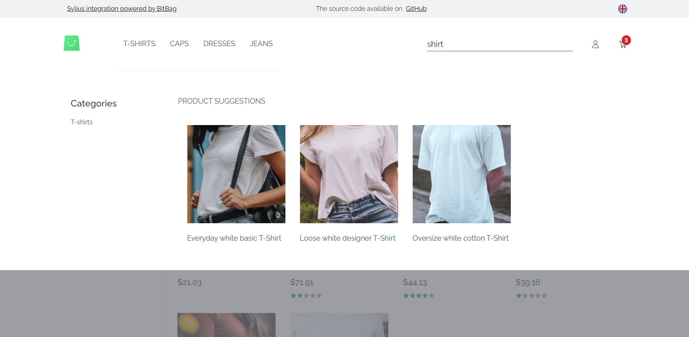

3. Account icon - allows us to toggle [login modal](#login-modal), or to open [my account page](#my-account-page) if a user is already logged in

4. Cart icon - allows us to open [cart sidebar](#cart-sidebar)

5. Language switcher - allows us to open the language selection menu

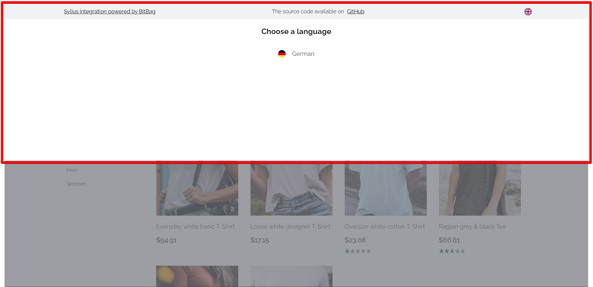

## Category page

The category page can be accessed by selecting a category from the header navigation:

### Category page legend:

1. Breadcrumbs - show your current location, and lets you navigate between shown pages.

2. Category tree - lets you navigate between subcategories of the currently selected category.

3. Category header - has some useful utilities for using the category page:

   - Filters - allows you to toggle the filter sidebar. From this sidebar, we can filter visible products by their attributes, and their price.

   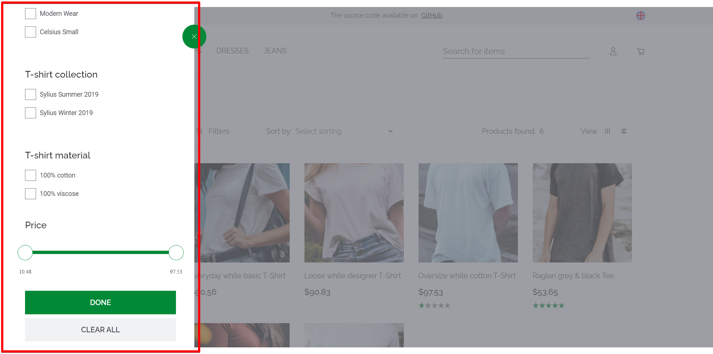

   - Sort by - allows you to sort visible products in different ways.

   

   - Products found - shows you the number of products in the selected category, this number takes into consideration active filters.

   

   - View - lets you toggle between two product views:

     - Grid view (default view) - activated by clicking highlighted icon

     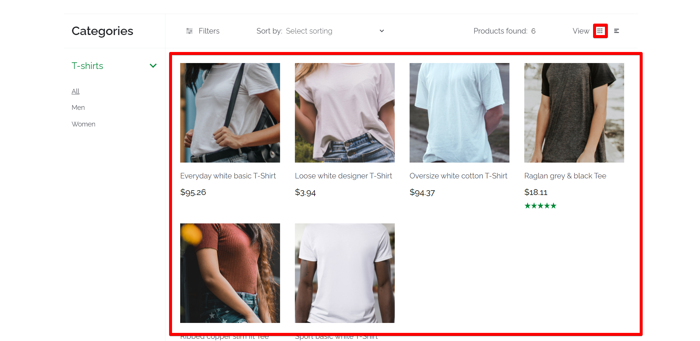

     - List view - activated by clicking highlighted icon

     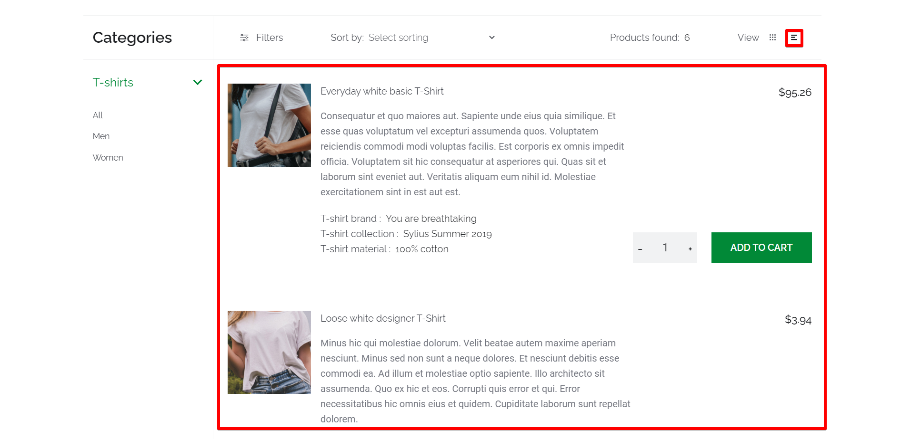

4. Product card - hovering over this card allows you to add the hovered product to the [cart](#cart-sidebar).

## Login modal

The login modal can be accessed by clicking the account icon on the header.

### Login modal legend:

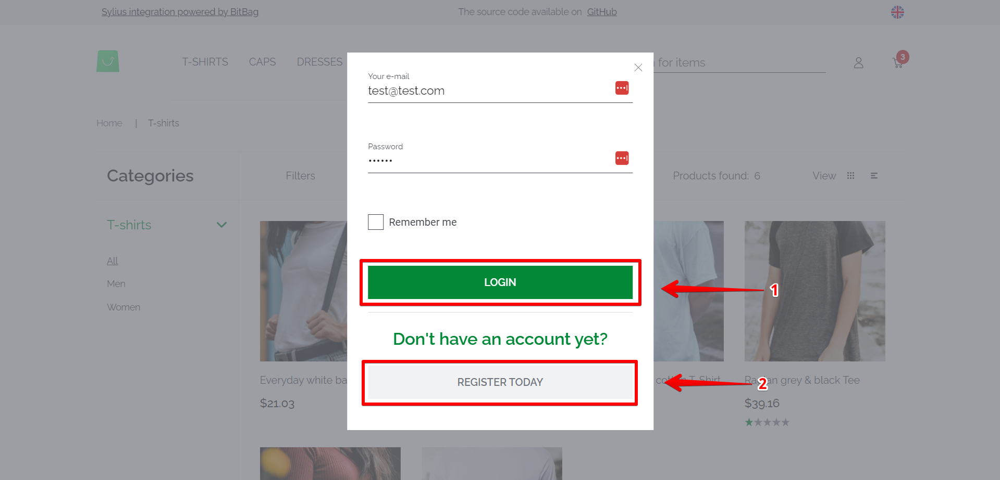

1. Login button - allows you to log in to created accounts

2. Register today button - toggles registration modal

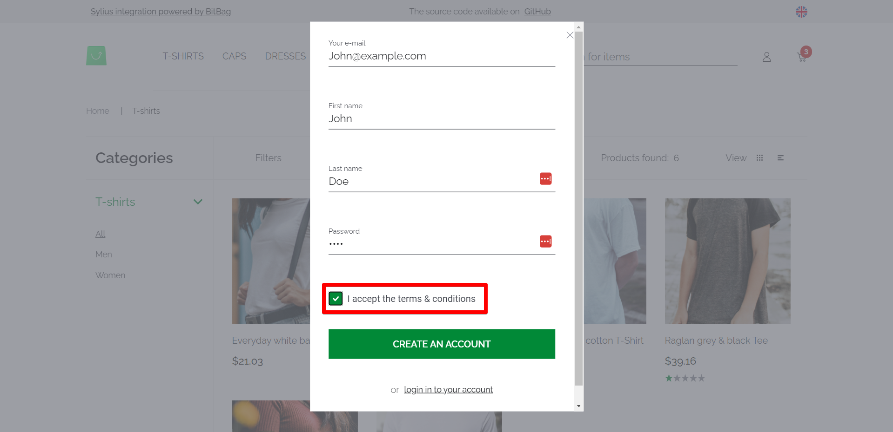

From here you can create a new account by filling in the form above, `I accept the terms & conditions` has to be selected to create a new account.

## My account page

To access this page you have to:

1. Click the account icon on the header

2. Fill in the login form and press the login button

3. After logging in you should be redirected to my account page

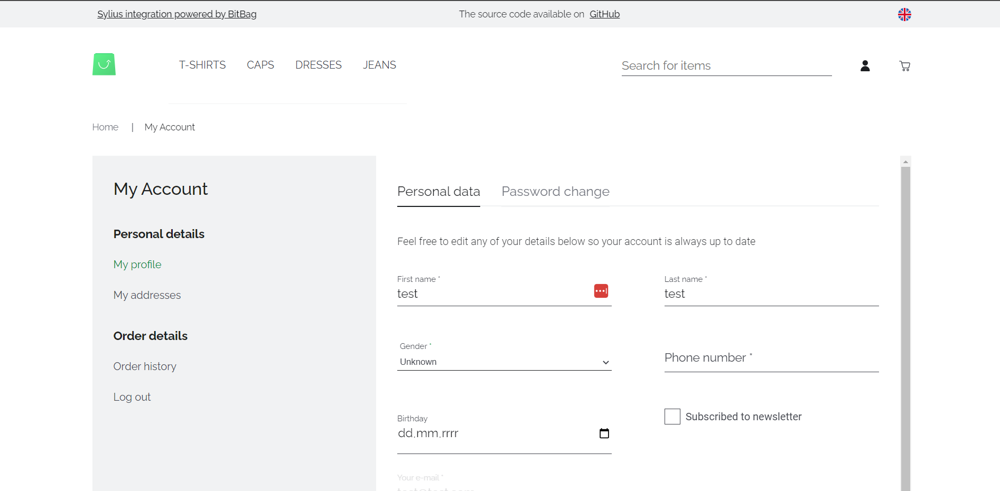

4. Afterward, you can access my account page from any other page by clicking **filled in** account icon, as long as you are still logged in

### My account page legend:

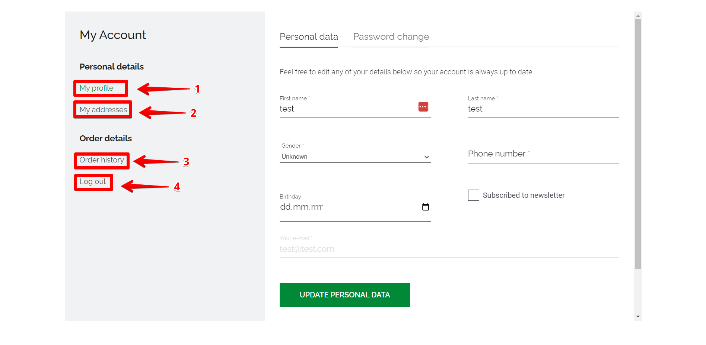

1. My profile - from here you can:

   - Change your personal information

   

   - Change your password

   

2. My addresses - from here you can:

   - View your addresses

   

   - Edit your addresses

   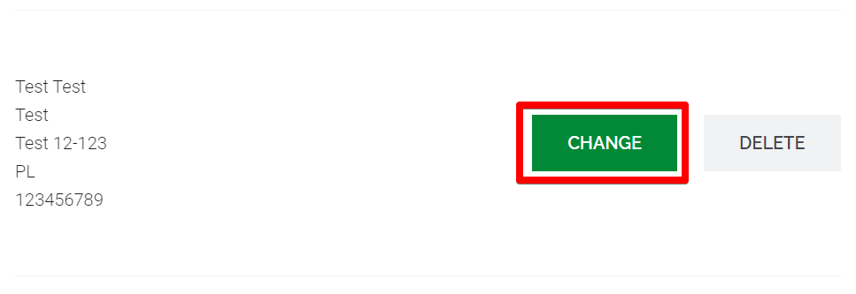

   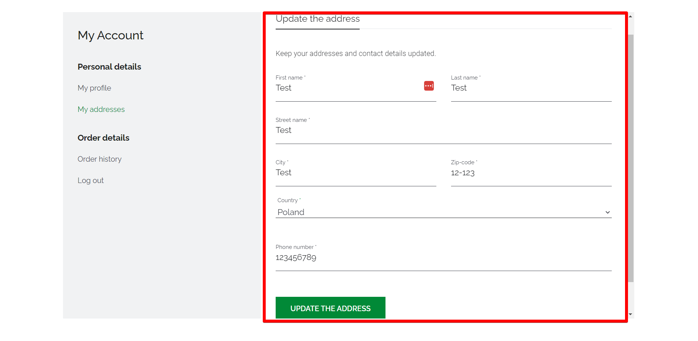

   - Delete your addresses

   

3. Order history - here you can view your orders

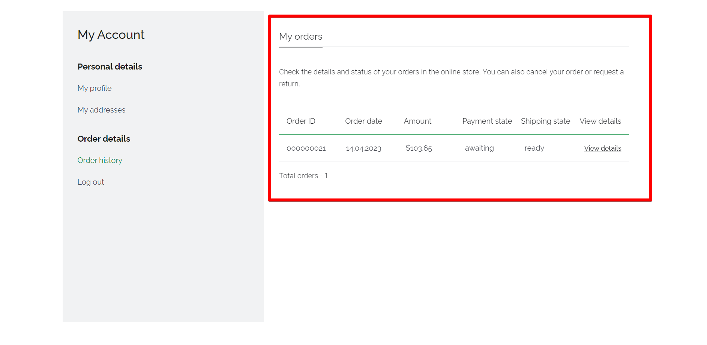

4. Log out - allows you to log out from your account

## Wishlists sidebar

Wishlist feature is only active when logged in.

To access the wishlists sidebar click on the wishlist icon on the header.

### Wishlists sidebar legend:

1. Add new wishlist - allows you to create a new wishlist with custom name, click create to confirm or cancel to go back.

2. Wishlist - click on a wishlist to view its items.

3. Remove wishlist icon - appears when user has at least two wishlists, click and confirm to remove wishlist.

### Single wishlist in a sidebar legend:

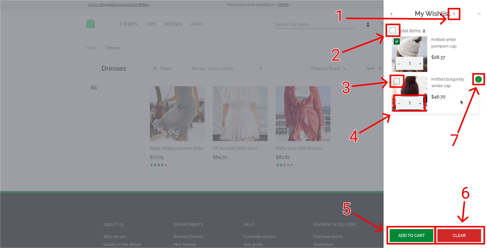

1. Change wishlist name - displays input field to change wishlist name, click change to confirm or cancel to go back.

2. Select everything checkbox - allows you to select or deselect all items in a wishlist.

3. Select single item checkbox - allows you to select or deselect a single item in a wishlist.

4. Quantity selector - allows you to change how much of a selected item you want to add when clicking add to cart button.

5. Add to cart - adds selected items to cart.

6. Clear - removes all items from wishlist.

7. Remove item icon - appears if you hover your mouse over an item, and allows you to remove the hovered item from a wishlist.

## Add item to wishlist dropdown

Logged in user can add or remove items from wishlists by using the wishlists dropdown in two places:

1. Product card on category page.
  

2. Heart icon next to rating on product page.
  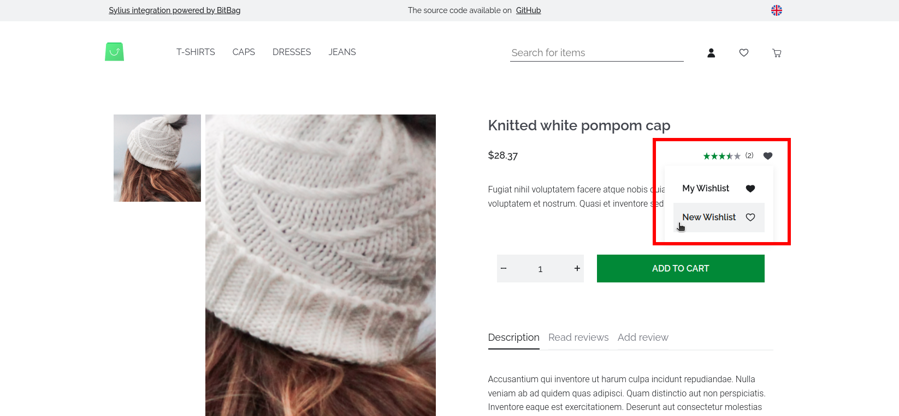

To add item to wishlist simply click the heart icon to open dropdown menu and select a wishlist from the list. Heart icon is filled in when item is in at least one wishlist. Heart icon in dropdown menu next to wishlist name indicates if item is in that wishlist.

## Cart sidebar

To access the cart sidebar click on the cart icon on the header.

If you have any products in your cart, the icon will have a badge in a corner with the number of products in a cart.

### Cart sidebar legend:

1. Product list - list of items in your cart.

2. Quantity selector - allows you to change how much of a selected item you have in a cart.

3. Remove icon - appears if you hover your mouse over an item, and allows you to remove the hovered item from a cart.

4. Go to checkout button - takes you to the [checkout page](#checkout-page).

## Checkout page

Checkout page can be accessed through [cart](#cart-sidebar).

Checkout is split into 3 steps:

1. Billing - here you can put your billing information for your order.

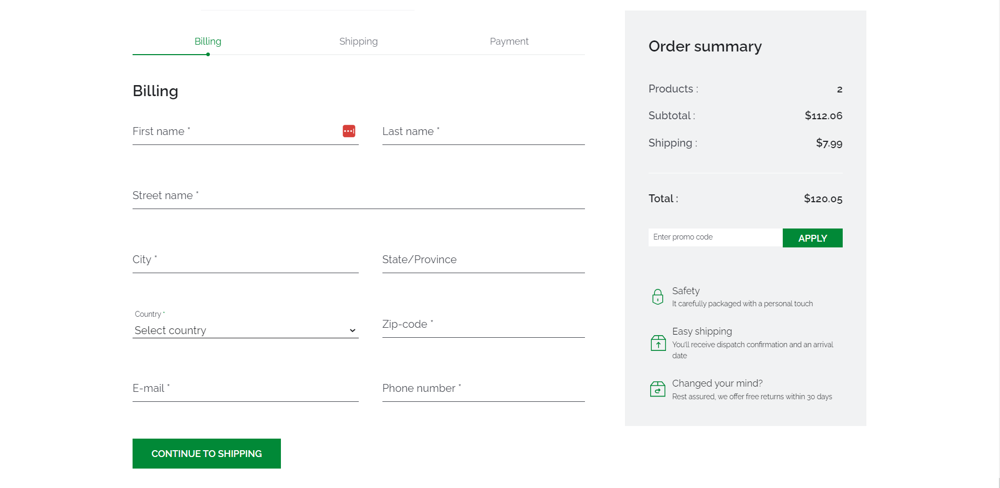

If you are logged in, and have any addresses saved you will be able to select them, to fill billing form with them.

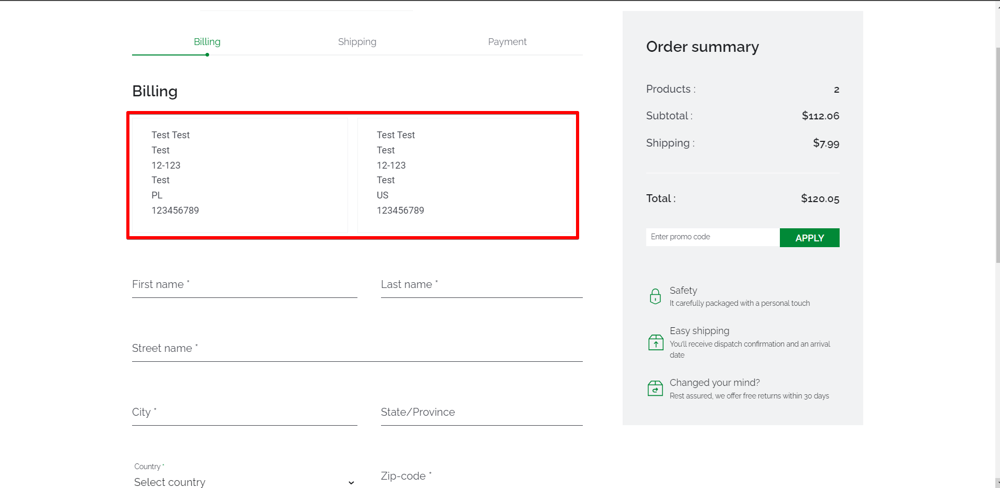

2. Shipping - here you can put your shipping information for your order.

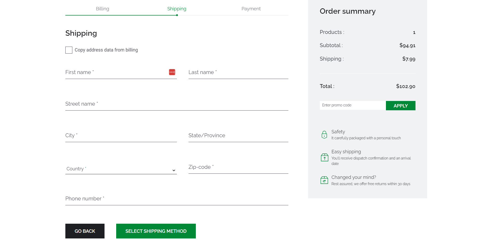

Same as in billing if you are logged in you can select from saved addresses.

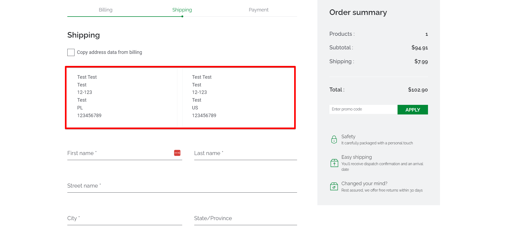

Additionally, you have an option of using the same information as in the billing step for your shipping, by selecting `Copy address data from billing` checkbox.

After filling in the shipping form you can click on `SELECT SHIPPING METHOD` button.

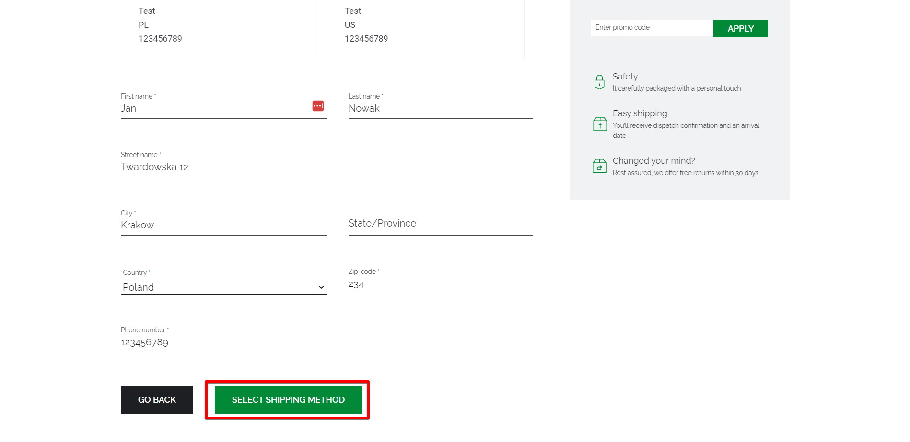

Clicking that button will open shipping method selection list.

3. Payment - here you can see final preview of items in your cart, and select payment method.

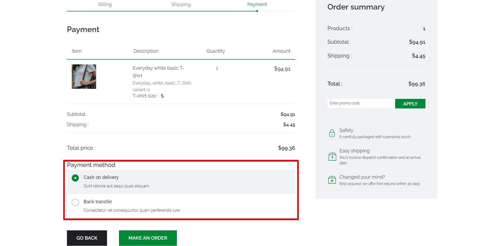

After going through all steps your order will be made and you will be redirected to thank you page.

## Variant selector

Variant selector is a modal that allows you to select a variant of a product. This modal is only available on products with variants on category page. It is displayed automatically when you click on cart icon on a product card. Cart icon is only displayed on desktop version.

### Variant selector modal legend:

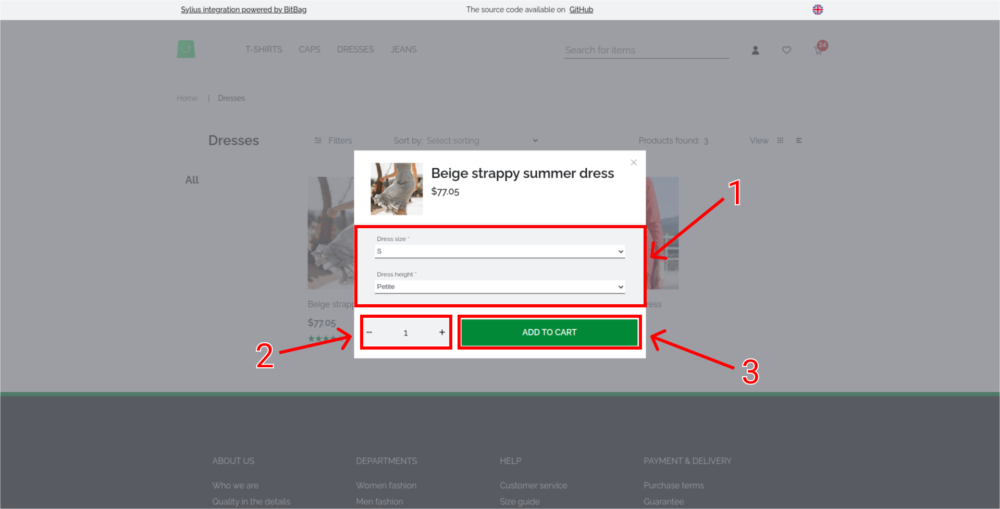

1. Option fields - allows user to select a variant of a product.

2. Quantity selector - allows user to change how much of a selected item you want to add when clicking add to cart button.

3. Add to cart button - adds items wtith selectedo options to cart.
